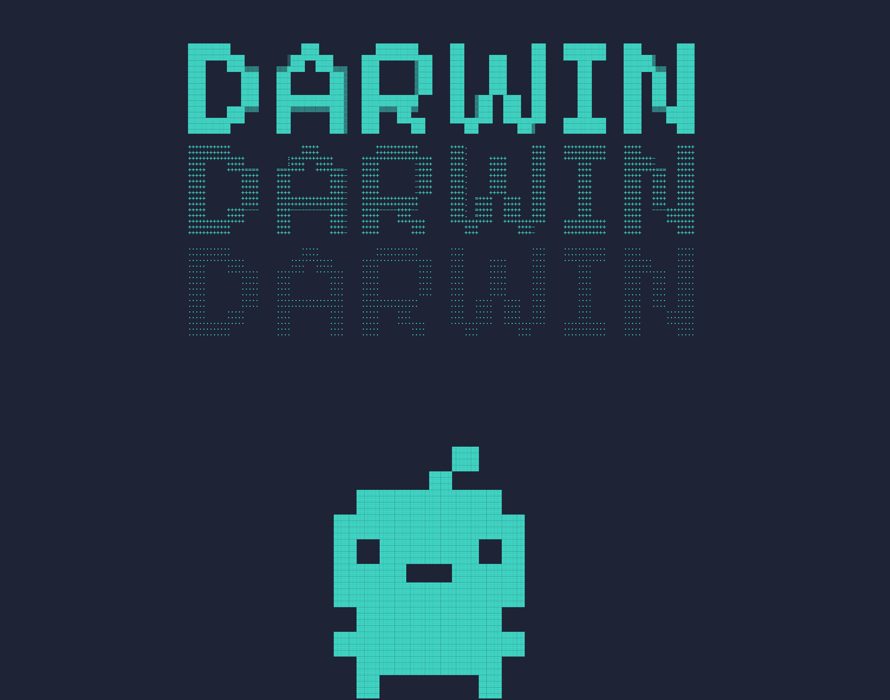

# Local Darwin - Agente de Coding Local 🧬



Local Darwin es un asistente de ingeniería de software local potenciado por modelos de lenguaje (LLMs) ejecutados en tu propia máquina mediante Ollama. A diferencia de un simple chat, este agente tiene la capacidad de indexar tu código, comprender sus relaciones y utilizar herramientas para leer, escribir o ejecutar comandos en tu terminal.

## 🚀 Arquitectura y Capacidades Actuales

El proyecto se ha construido en distintas fases incrementales:

1. **El Esqueleto (CLI):** Un punto de entrada modular construido con `Typer` que se conecta fluidamente con modelos locales usando compatibilidad con la API de OpenAI.
2. **La Vista (File System & AST):** Capacidad para explorar tu directorio e interpretar tu código Python sin necesidad de leerlo línea por línea, abstrayendo clases y funciones nativamente.
3. **La Memoria (NetworkX & SQLite):** Motor de indexación que construye un mapa lógico de cómo tus archivos dependen unos de otros y lo persiste en una base de datos local para análisis súper rápidos.
4. **Las Manos (Tool Use & Agent Loop):** El corazón de la autonomía. El agente razona y decide dinámicamente qué herramientas ejecutar (`read_file`, `write_file`, `execute_command`) en bucles lógicos hasta resolver la tarea que le pediste.

## ⚙️ Requisitos y Configuración

1. **Python 3+** y un manejador de entornos y paquetes como `uv` (recomendado).
2. **Ollama** instalado y corriendo localmente (`ollama serve`).
3. Descargar el modelo que desees utilizar (por defecto la app utiliza `gemma4`, pero puedes pasar el argumento `--model` para usar otros como `llama3`).

Para iniciar el proyecto:

```bash
uv venv
uv pip install -r requirements.txt # O instala las dependencias (typer, openai, rich, networkx, etc.)
```

## 💻 Cómo Usarlo

Local Darwin se usa interactuando con `main.py` desde la línea de comandos:

- **Modo conversacional:** `uv run main.py chat "¿Cómo optimizo esta función?"`
- **Inspección rápida:** `uv run main.py inspect .`
- **Indexado de dependencias:** `uv run main.py index .`
- **Análisis de dependencias:** `uv run main.py analyze main.py`
- **Modo Agente Autónomo:** `uv run main.py run "Crea una función en utils.py y escribe tests con pytest"`

Para obtener más detalles sobre el funcionamiento interno y ejemplos precisos de cada comando, visita la documentación de los comandos del CLI (`tools/comandos_cli.md`).

---

_El código ignora automáticamente los directorios configurados en `.darwinignore` (ej: `.venv`, `__pycache__`) para mayor eficiencia y velocidad de análisis._
